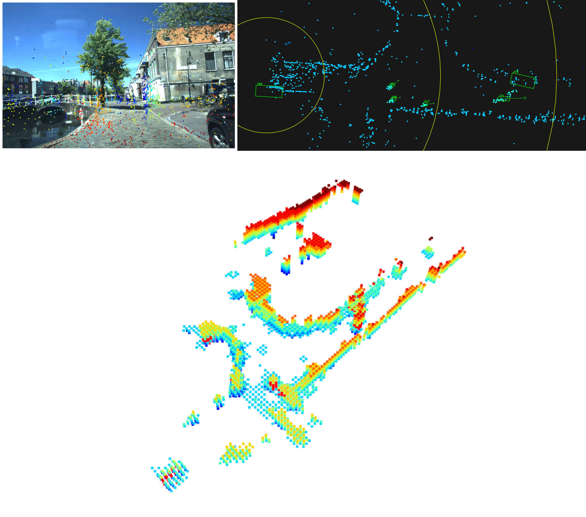
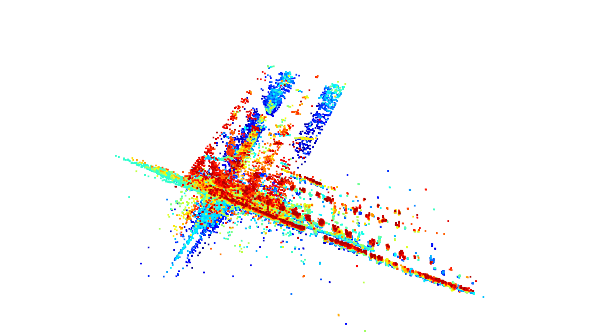
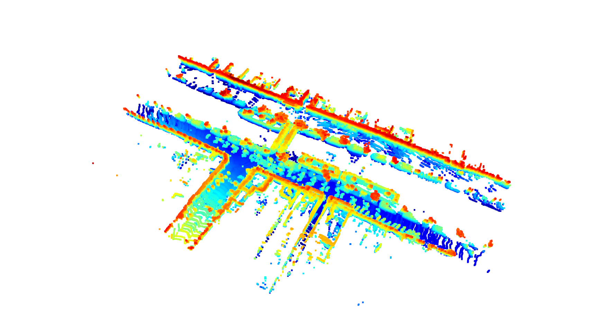
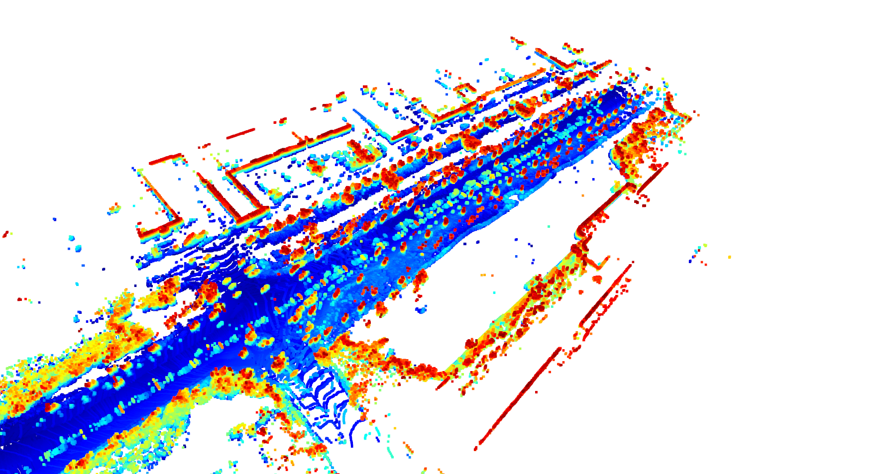
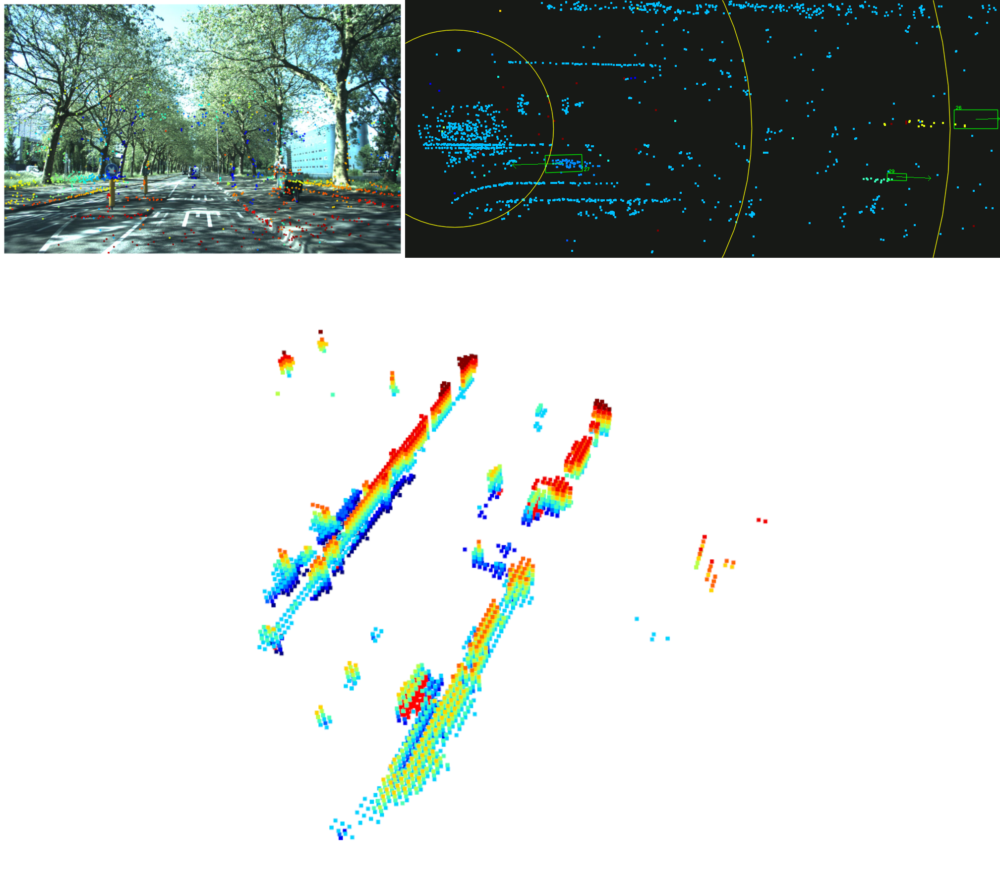

# Rethinking of mmWave Radar Perception in Autonomous Driving System



## Current situation

- Auxiliary sensor in high-level AD system

- Due to the low accuracy & false positive & ghost & multi-path refelection 

- Lack of height measurement ability which is dangerous in some scene

- Sparsity point cloud without semantic info

- Poor ability to perceive the surrounding environment

### Traditional radar ability

- Dynamic object detection (DOD)

    - mainly used in highway

    - can not work in urban scene and any complex scene

- low confidence in sensor fusion system due to the low accuracy

By using the ML-based method, the accuracy of radar has been improved a lot. Here is some on-board radar's performance in the real world:


By model design and data augmentation, our traditional radar (2000 pts/s) can detect the object with high accuracy and maintain a good performance in stationary and dynamic scene at the same time.

But some issues still exist, such as bad performance in tunnel scene, urban scene, and so on. Which limit the massive use of radar in high-level AD system. Tesla's given up of radar is a good example. But as we all know, the 4D radar returns to the new generation of Tesla's AD system. 

The situation has changed, the next generation 4D radar is coming.

---

## The next generation 4D radar's ability

- Point cloud count increased hundred times (80,000 pts/s)

- More precise angle resolution

- The ability of height measurement

<video width=800 height=300 src="img/rb_cross.mp4" type="video/mp4" controls="controls"></video>

### what we can do with the new 4D radar

- High quality 3d point cloud [raw data] with various of information

- Oriented bbox with velocity / category [close-set]

- Environment construct [open-set]

    - Bev occupancy / free space / seg

    - 3D occupancy with motion information


The experiment result of the data show that the 4D radar has a good performance in urban scene, witch means the 4D radar can be used in high-level AD system.

But only provide such information is not enough, we need to make fuller use of the 4D radar's information to extract richer surrounding environment information.

### Point cloud and point-level seg

- Spasity / lack of topology info

- Can only modify but can not create which means its not work when lost target

- Can only seg specific class with mannually annotated label [close-set]

- Still need 2ed stage to generate object / bbox 

### Bbox

- Difficult to train to regress the 3d bbox especially the orientation

- Lost target in corner case

- The bbox is not the real shape of the object which is dangerous in some scene

- Only a small part of the pts is used as foreground
    
    - Less training data

    - Lower data utilizaiton

    - A huge waste of radar perception ability

- Relies on manully annotation which cost a lot 

### What we can do additionally

- Detect all the real world object [open-set] with a real shape and motion information

    - Complement the bbox detection and improve the robustness

    - Percept the common obstacle like the tree / pole / wall and so on

- Reconstruct the 3d surrounding environment with semantic information

```

- The ability of environment reconstruct [open-set]

    - Bev occupancy / free space / seg

    - 3D occupancy with motion information

```

### The occupancy network


- Why choose occupancy netwrok?

    - More natural and unified way of spatial representation [enitre AD pipeline]

    - Comprehensive information about object shape and surrounding environment

    - More efficient interaction with multi-sensor fusion and map / planning / control

    - More efficient interaction with multi-task learning

    - Face the future of end-to-end autonomous driving

- How the other sensor work with occupancy network?

    - Vision

        - Tesla release Occupancy-networks based on pure vision input

        - It need a lot of camera data and can not work well in bad weather

        - It relies on a huge data-driven system to generate the training data and train the network

        - It also relies on a powerful real-time on-board computing platform to run the network

        - The transformer network is not easy to train and port on board

        - All of these cost a lot from off board to on board
 
    - Lidar

        - Lidar can naturally generate occupancy by simply voxelization

        - But it is not work in bad weather and long range detection

        - The motion information need extra cost and the accuracy is not good enough

        - Long-range and high-precision lidar is too expensive to be used in mass production


We use lidar and radar point cloud to reconstruct the 3d surrounding environment respectively.Through the experiment, we find that the 4D radar have the potential to reconstruct the 3d surrounding environment compared with the lidar mapping result.








- Why choose 4D radar? 

    - A cheap and robust sensor which can work in all weather and long range

    - Can provide motion information without any extra cost

    - Can provide a high quality point cloud just like lidar

    - Use a simply network to generate the 3d occupancy with motion information

    - Low cost, high accuracy, high robustness, strong generalization, easy to port on board

    - Can work with camera to generate a high quality 3d occupancy

        - Hugely reduces the cost compared with a pure camera system


### Our 4D radar occupancy network

Using radar point cloud to directly generate the 3d occupancy with motion status is available. But the
result is not as good as the lidar result:

- too much noise and ghost point

- the edge is not clear

- self occlusion is serious

And that's why we need a network to reconstruct the 3d surrounding environment.

The most important thing is that where to get the supervision signal to train the occupancy network. In our case, we use the lidar point cloud to generate the supervision signal. The pipeline is as follows:

    1. Use the annotated bbox to lable the lidar point cloud
    
    2. Use ego car motion information and background point cloud to mapping the surrounding environment
    
    3. Cut the 3d occupancy with motion information from the 3d map
    
    4. Add the current frame foreground point cloud to the 3d occupancy

As manual annotation is too expensive, our method can significantly reduce the cost of annotation. Through the training, we gradually make the cheaper radar performance close the expensive lidar performance, even better in some cases.

### Our network

- Input: 4D radar point cloud

- Output:

    - 3D bbox with motion information

    - 3D occupancy represent the surrounding environment and common obstacle

    - 3D semantic seg represent the road user with certain category


- Model: 

    - Scatter & PFN

    - Sparsity voxel encoder & fuser
    
    - 3D occupancy decoder

    - Bbox decoder


- Supervision signal:

    - 3d bbox annotation **manual** 

    - 3d semantic annotation  **post-processing** weakly supervised

    - 3d occupancy reconstructed **lidar point cloud mapping** weakly supervised cross modality

- Loss:

    - 3d bbox loss

    - 3d semantic loss

    - 3d occupancy loss

- Expriment:

    - 2d light-weight version

    - 3d light-weight version

    

    

    

    


- Pros and cons

    - Pros:

        - When the 3d bbox network loss target, the 3d occupancy network can still work

        - Be able to output the static perception result, greatly expand the mmWave radar's capability

        - Can detect common/unknown obstacle with a real shape and motion information

        - Can reconstruct the 3d surrounding environment with semantic information and motion information

    - Cons:

        - The network is more complex than the 2d bbox network

        - The training is more time-consuming than the 2d bbox network

        - The noise still exists

    - Solution:

        - Reduce the network complexity by clever network design

        - Data augmentation and ground truth refinement

## Future work

I will also leave some open question for future thinking and research:

- In DSP level, how to retain more information to downstream processing?

    - Range-Doppler-Angle image is dense, lift to 3D point cloud directly is an option

- In perception level, how to reconstruct the 3D surrounding environment efficiently?

- How to better transform the disadvantage of inadequate accuracy into the advantage of good generalization?

- What is the best way to represent the unknown obstacle?

- How to fuse the 4D radar with other sensors especially camera?

    - The pure vision system data closed-loop are very expensive，Lidar is expensive and can not work in bad weather, and detect range is missmatched with vision

    - 4D Radar with camera is a good choice, but how to fuse them efficiently?

Compared to traditional radar, 4D radar is in a completely different league in terms of algorithms and functionalities. How to make full use of the 4D radar's ability to perceive the surrounding environment is a very interesting topic. We hope that our work can provide some inspiration for the future development of 4D radar.


## Reference

This project use the MMDetection3D framework, the urban dataset is from View-of-Delft Dataset, and some idea is referenced from the TPVFormer paper.

```latex
@misc{mmdet3d2020,
    title={{MMDetection3D: OpenMMLab} next-generation platform for general {3D} object detection},
    author={MMDetection3D Contributors},
    howpublished = {\url{https://github.com/open-mmlab/mmdetection3d}},
    year={2020}
}

@article{huang2023tri,
    title={Tri-Perspective View for Vision-Based 3D Semantic Occupancy Prediction},
    author={Huang, Yuanhui and Zheng, Wenzhao and Zhang, Yunpeng and Zhou, Jie and Lu, Jiwen },
    journal={arXiv preprint arXiv:2302.07817},
    year={2023}
}

@ARTICLE{apalffy2022,
  author={Palffy, Andras and Pool, Ewoud and Baratam, Srimannarayana and Kooij, Julian F. P. and Gavrila, Dariu M.},
  journal={IEEE Robotics and Automation Letters}, 
  title={Multi-Class Road User Detection With 3+1D Radar in the View-of-Delft Dataset}, 
  year={2022},
  volume={7},
  number={2},
  pages={4961-4968},
  doi={10.1109/LRA.2022.3147324}}

```

## Contact

If you have any question, please contact me by email:  [yyz_hit@163.com](mailto:yyz_hit@163.com)
